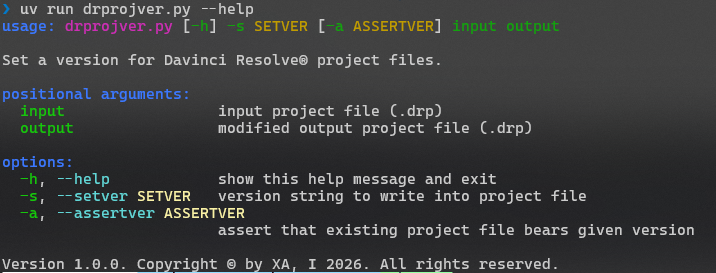

# About

A Python script that parses Blackmagic® Davinci Resolve® project files (.drp) and allows patching (downgrading) project version.

## Note

This tool does **NOT** convert or migrate data structures or adjust XML data to different project versions' schemata!
It does nothing more than patch a project file such that Davinci Resolve® regards it as a project file of a certain version.

## Resolve versions v. Project versions

| Davinci Resolve version | Project version |
|-------------------------|-----------------|
| 20 | 15 |
| 19 | 14 |
| …… | …… |

## Usage

Prepare system:
~~~
$ uv python install
$ uv sync
~~~

Run the tool to set a version for Davinci Resolve® project files:
~~~
$ uv run drprojver.py [-h] -s ‹SETVER› [-a ‹ASSERTVER›] ‹input› ‹output›
~~~

- Positional arguments:
  - `‹input›`                 input project file (.drp)
  - `‹output›`                modified output project file (.drp)
- Options:
  - `-h`, `--help`
     show a help message and exit
  - `-s`, `--setver ‹SETVER›`
    version string to write into project file
  - `-a`, `--assertver ‹ASSERTVER›`
    assert that existing project file bears given version

## Screenshot

